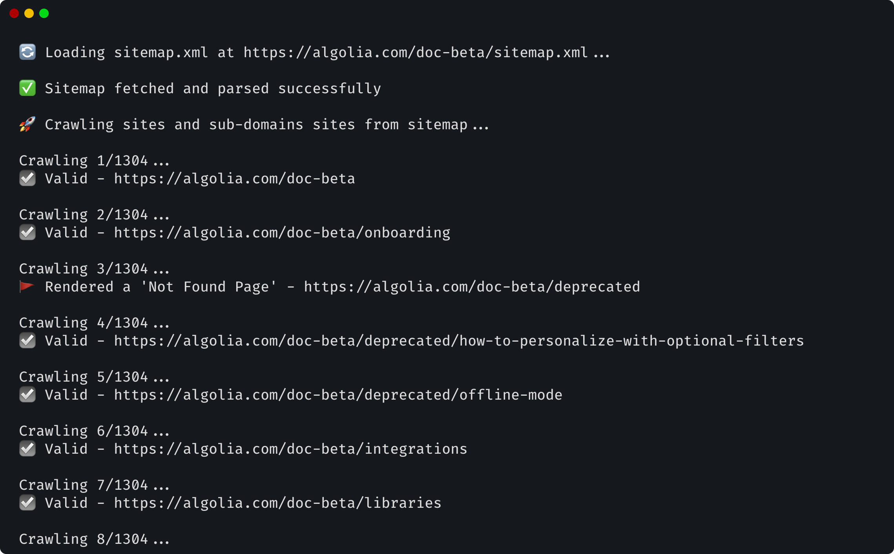

# 404 Crawler

A command line interface to crawl pages from sitemap urls and all their sub-path.



## Get started

### Install

```sh
pnpm i
```

### Build

```sh
pnpm build
```

### Run

```
node dist/cli.js crawl <options>
```
